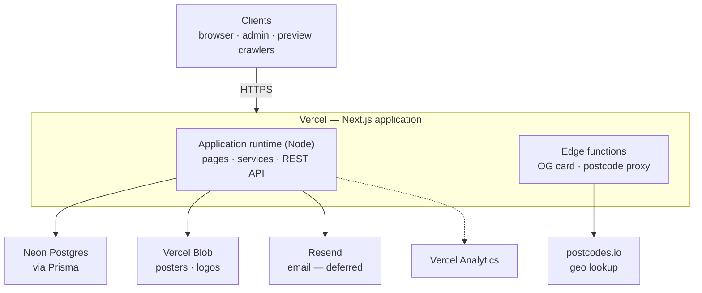
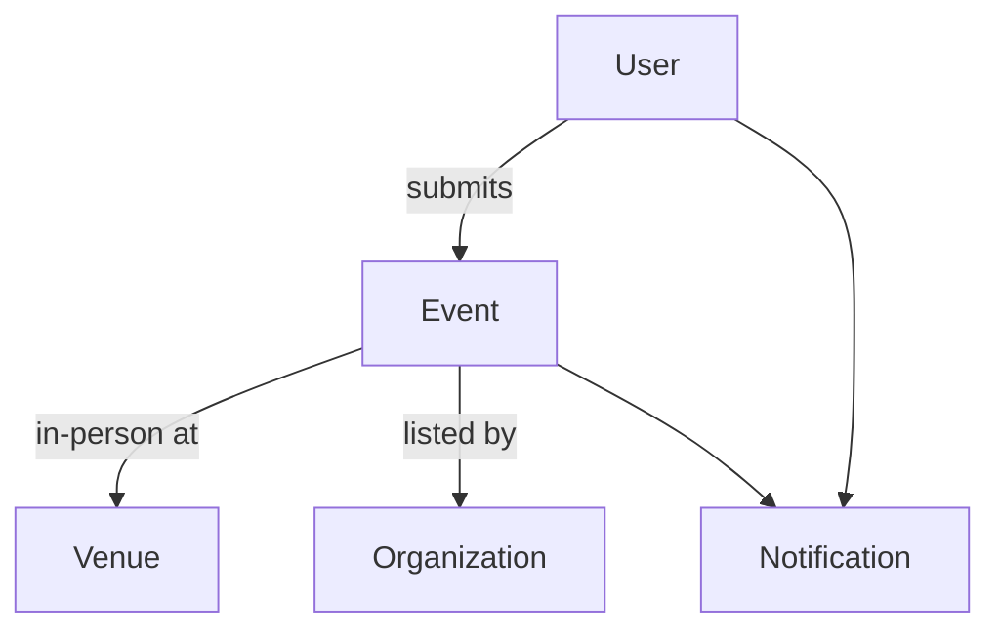
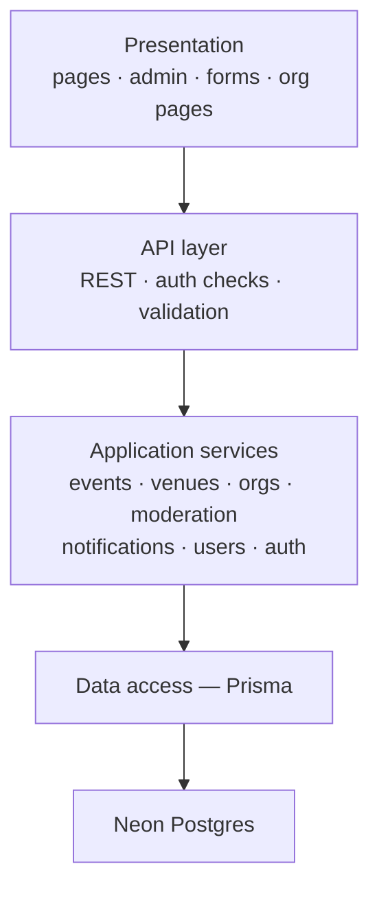

# Architecture

Orientation shape of the system

## Tech stack

| Concern    | Choice                                                       |
| ---------- | ------------------------------------------------------------ |
| Framework  | Next.js 16 (App Router), TypeScript, React Server Components |
| Database   | Neon Postgres via Prisma                                     |
| Auth       | Auth.js v5 — Credentials provider, JWT sessions              |
| UI         | Tailwind CSS, shadcn/ui                                      |
| i18n       | next-intl — URL-prefixed locales (`/en` default, `/uk`)      |
| Images     | Vercel Blob (signed uploads)                                 |
| Email      | Resend (sending deferred until the custom domain is live)    |
| OG cards   | `@vercel/og` (edge runtime)                                  |
| Geo        | postcodes.io (postcode → city/region/lat-lng)                |
| Hosting    | Vercel (free tier throughout)                                |
| Monitoring | Vercel Analytics                                             |

---

## Architecture style

A **modular monolith**: one Next.js app, deployed as a single unit on Vercel, organised into feature modules with enforced boundaries. The choice fits a solo developer on a short timeline — one repo, one deploy, one mental model — while the module boundaries keep it from rotting into a big ball of mud and mark the seams where later phases plug in.

The one architecturally significant split is **runtime**, not deployment: most code runs on Node serverless functions, but the OG card and the postcode proxy run on the **edge** and are cached hard (7-day and 30-day respectively). The edge-rendered card is the acquisition path a crawler hits cold; keeping the postcode lookup off the Node budget is a free-tier cost decision.



---

## Project structure

```
src/
├── app/                 # routes only — orchestration, no business logic
│   ├── [locale]/        # public, localised pages (/en, /uk)
│   ├── admin/           # NOT localised — English only
│   └── api/             # route handlers — thin, delegate to features
├── components/          # shared UI
├── features/            # domain modules (see below)
│   ├── events/
│   ├── organizations/
│   ├── venues/
│   ├── moderation/
│   ├── notifications/
│   ├── auth/
│   └── users/
├── lib/                 # pure utilities — no feature imports
├── messages/            # next-intl catalogs (en, uk)
├── prisma/              # schema + client
└── proxy.ts             # Next.js 16 proxy (replaces middleware.ts) — next-intl locale routing
```

**Boundary rules:** `app/` orchestrates `features/`; features never import from `app/`. A feature touches another only through its public service, never its tables. `lib/` is pure (`clean-url`, `resolve-city`, `date-ranges`, `pick-locale-field`, `normalizePostcode`). Prisma is the single database gateway, and each table has exactly one owning module.

---

## Modules

| Module        | Owns                     | Responsibility                                                            |
| ------------- | ------------------------ | ------------------------------------------------------------------------- |
| events        | `Event`                  | Create, owner-edit-while-pending, cancel, soft-delete, filtered retrieval |
| organizations | `Organization`           | Admin CRUD, verification badge, org→event display                         |
| venues        | `Venue`                  | Postcode lookup, city resolution, dedup, manual-create escape hatch       |
| moderation    | (acts on `Event`)        | Approve / reject, image review — ADMIN only                               |
| notifications | `Notification`           | In-app persistence + email dispatch (deferred), read-state                |
| auth          | tokens, session          | Credentials login, JWT session, verification + reset                      |
| users         | `User`, `ContactMessage` | Registration, profile, soft-delete + anonymisation, contact inbox         |

---

## Data model

Core entities and how they relate. The full schema (fields, indexes, invariants) is `prisma/schema.prisma`.



| Table                                           | Purpose                                                            |
| ----------------------------------------------- | ------------------------------------------------------------------ |
| `User`                                          | Identity, access, admin-only contact (PII never rendered publicly) |
| `Organization`                                  | Community groups; admin-managed in Phase 1                         |
| `Venue`                                         | Normalised, deduped locations resolved from postcodes              |
| `Event`                                         | The directory record; lifecycle + cancellation + soft-delete state |
| `Notification`                                  | In-app + (deferred) email alerts from moderation actions           |
| `ContactMessage`                                | Public contact-form submissions → admin inbox                      |
| `EmailVerificationToken` / `PasswordResetToken` | Auth email flows                                                   |

An `Event` is in-person (`venueId` set) **or** online (`isOnline` + `onlineUrl`); it is labelled by an `Organization` **or** a free-text `organizerName`. Cancellation and deletion are soft (`cancelledAt`, `deletedAt`) so records stay intact. Deleting a `User` anonymises the row but retains their events.

---

## Request flow

Within the Node runtime, a request passes through four logical layers. Authorization is enforced at the service layer, so pages and routes stay thin.



The core domain flow is the event lifecycle: a submission is created `PENDING`, a human admin approves or rejects it, and only `APPROVED` (non-deleted) events appear on public surfaces.

---

## Cross-cutting concerns

- **Auth** — Auth.js v5 Credentials + JWT; roles `USER` / `ADMIN`; ownership and role checks live in the service layer.
- **i18n** — two mechanisms: next-intl message catalogs for UI chrome (admin stays English), and per-field content resolution (UK-first with English fallback) for event data.
- **Caching** — three tiers by rate of change: postcode proxy (30-day edge), OG image (7-day edge), event directory (live, so approvals show immediately).
- **Security** — descriptions are plain-text only (the single XSS boundary); all user URLs pass a shared `http(s)` allowlist; uploads are signed, type-sniffed and EXIF-stripped; user URLs are never fetched server-side (no SSRF).
- **Observability** — Vercel Analytics with cross-city click-through deliberately instrumented as the key product metric; a nightly cron emails the admin when the pending queue is non-empty.

---

## Routes at a glance

Public pages are locale-prefixed (`/en`, `/uk`); `/admin/*` and `/api/*` are not.

- **Public** — `/` (filterable event list = home), `/events/[id]` (detail, the share target), `/orgs/[slug]`, `/contact`
- **Authenticated** — `/submit`, `/my/events`, `/events/[id]/edit` (own, while pending), `/profile`, `/notifications`
- **Admin** — `/admin` (queue), `/admin/orgs`, `/admin/events/[id]/edit`, `/admin/venues/new`, `/admin/users`, `/admin/messages`
- **API** — `/api/events`, `/api/og/[id]`, `/api/postcode/[code]`, `/api/uploads/sign`, `/api/notifications`, `/api/account`, `/api/contact`, `/api/admin/events/[id]/{approve,reject}`
