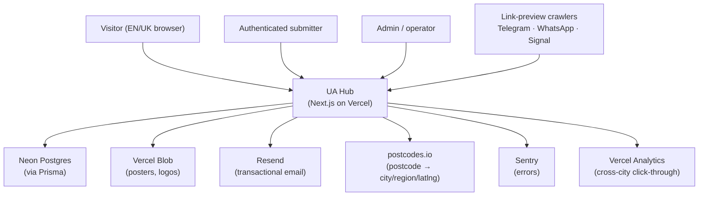
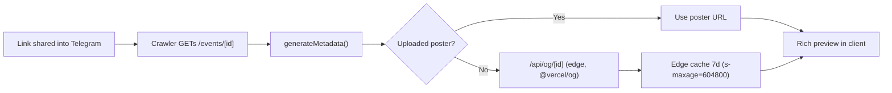

# UA Hub — Architecture Reference

> **Status:** Authoritative for Phase 1 (Weeks 1–2 build, 1.5 for Weeks 3–4).
> **Supersedes:** the architecture sections of `DESIGN.md` and `TECH-ARCH.md` by consolidating them. Where any of the three disagree, **this file wins** — and the disagreement should be reported to the maintainer so the source docs get reconciled.
> **Audience:** the solo developer (and any AI coding agent) building Phase 1. Written to be read top-to-bottom once, then used as a reference.

---

## 0. How to read this document

The product strategy lives in `DESIGN.md`; the component inventory lives in `TECH-ARCH.md`. This file is the _architect's view_: the forces, the boundaries, the load-bearing decisions, the runtime behaviour, and the risks. It deliberately does **not** restate the full Prisma schema or the full route list — `prisma/schema.prisma` and the routes table in `DESIGN.md` remain the source of truth for those. What this file adds on top of the two source docs is called out explicitly in §15.

---

## 1. North Star (the thing the architecture must protect)

UA Hub exists to do **one** thing Telegram cannot: show _every_ Ukrainian community event across the UK in one filterable place, then push individual events back into Telegram as a share card that looks designed.

Two jobs, two surfaces, and every architectural decision serves one of them:

| Job                             | Surface                                            | Architectural priority                                                                                                                                          |
| ------------------------------- | -------------------------------------------------- | --------------------------------------------------------------------------------------------------------------------------------------------------------------- |
| **Acquisition**                 | The OG share card (lives in Telegram)              | The card is a _first-class component_, edge-rendered, snapshot-tested. It is the face of the product.                                                           |
| **Retention / differentiation** | The cross-city filterable list (lives on the site) | The city filter must never degrade. Anything that corrupts the city dimension (free-text typos, unresolved postcodes) is an architectural defect, not a UX nit. |

If a decision doesn't protect the card or the filter, it is a candidate to cut. The design doc's strongest line — _"the cut list is the most important section"_ — is an architectural instruction, not a project-management one.

---

## 2. Architectural drivers

These forces explain nearly every decision downstream. When a future change feels wrong, check it against these.

- **Solo developer, 2-week ship.** Favour boring, well-trodden technology. No distributed systems, no service mesh, no premature abstraction. Optimise for one person holding the whole system in their head.
- **Free-tier ceiling.** Vercel Hobby + Neon free + Resend free + postcodes.io (no key). Cost is a hard constraint, not a preference: it forbids Stripe, paid address services, and any design that leans on always-on compute. It is _why_ caching is aggressive and _why_ user URLs are never fetched server-side.
- **Trust is human, not automated.** Moderation is the trust mechanism. There is no auto-approve in Phase 1. The architecture keeps a human in the publish path on purpose.
- **Shareability is the funnel.** The system is built to be _forwarded_. Every meaningful view (an event, a filtered list, an org page) must be a clean, shareable URL with a rich preview.
- **Bilingual is structural.** EN/UK is not a translation layer bolted on at the end — it shapes routing (URL-prefixed locales), content resolution (per-field fallback), and social metadata. It is designed in from commit one.

---

## 3. Architecture style — modular monolith

A single Next.js application, deployed as one unit on Vercel, organised into feature modules with enforced boundaries.

**Why a monolith here:** a solo developer on a 2-week clock gains nothing from network boundaries between services and pays dearly for them (deploy orchestration, distributed tracing, cross-service contracts). The whole system fits in one repo, one deploy, one mental model.

**Why _modular_:** the failure mode of a solo monolith is the big ball of mud — every file imports every other file, and by Phase 2 nobody can change anything safely. Module boundaries (§6) are the cheap insurance against that, and they are the seams along which Phase 2 self-service org onboarding will be cut.

---

## 4. System context (C4 L1)



The **link-preview crawler** is a first-class actor, not an afterthought. It does not run JavaScript, it requests `/events/[id]` purely to read `<meta>` tags, and the quality of what it gets back _is the acquisition funnel_. The system is designed so that a crawler hitting a cold page still receives a correct, cached OG image fast.

---

## 5. Container & deployment view (C4 L2)

Everything runs inside one Vercel project. The architecturally significant split is **which code runs on which runtime**, because that drives free-tier cost and cold-start behaviour.

| Concern                             | Runtime                     | Why                                                                                                         |
| ----------------------------------- | --------------------------- | ----------------------------------------------------------------------------------------------------------- |
| RSC pages, route handlers, services | Node (serverless functions) | Need Prisma/Auth.js; full Node APIs.                                                                        |
| `/api/og/[id]` (dynamic card)       | **Edge**                    | `@vercel/og` is built for edge; fonts inlined; cached 7 days at the edge so the function rarely runs.       |
| `/api/postcode/[code]` (proxy)      | **Edge**, 3s timeout        | Cheap pass-through to postcodes.io with a 30-day edge cache; keeps the lookup off the Node function budget. |
| Nightly admin digest                | Vercel Cron → Node          | Fires only when pending count > 0.                                                                          |

**Deploy pipeline:** GitHub push → Vercel build → `prisma migrate deploy` (never `db push` to prod) → production. Rollback is `vercel rollback`; **no destructive migrations in the first month** (D3/D4). Preview deployments per branch are the integration test surface.

---

## 6. Module structure & dependency rules (C4 L3)

```
src/
├── app/                 # routes only — orchestration, no business logic
│   ├── [locale]/        # public, localised pages
│   ├── admin/           # NOT localised — English only
│   └── api/             # route handlers — thin, delegate to features
├── features/
│   ├── events/          # owns: Event
│   ├── organizations/   # owns: Organization
│   ├── venues/          # owns: Venue
│   ├── moderation/      # owns: approval/rejection decisions over Event
│   ├── notifications/   # owns: Notification + dispatch
│   ├── auth/            # owns: session, password, token tables
│   └── users/           # owns: User, profile, soft-delete/anonymise
├── lib/                 # pure utilities — no feature imports
├── messages/            # next-intl catalogs (en, uk)
└── prisma/              # schema + client
```

**Dependency rules (enforce these — they are the whole point of "modular"):**

1. `app/` orchestrates `features/`. Features **never** import from `app/`.
2. A feature may call another feature only through that feature's **public service interface** (its `index.ts` / exported service), never by reaching into its internals or its tables. _Example:_ `moderation` changes an event's status by calling `events`' service, not by writing the `Event` row itself.
3. `lib/` is pure and feature-agnostic: `clean-url.ts`, `resolve-city.ts`, `date-ranges.ts`, `pick-locale-field.ts`, `normalizePostcode`. Nothing in `lib/` imports a feature.
4. The Prisma client is the single DB gateway. Each table has **one owning feature**; cross-feature reads go through the owner's service. This is what lets Phase 2 lift `organizations` toward self-service without untangling it from everything else.

| Module        | Owns                                                    | Core responsibility                                                                              |
| ------------- | ------------------------------------------------------- | ------------------------------------------------------------------------------------------------ |
| events        | `Event`                                                 | Create, owner-edit-while-pending, cancel, soft-delete, filtered retrieval, invariant enforcement |
| organizations | `Organization`                                          | Admin CRUD, verification badge, org→event display resolution                                     |
| venues        | `Venue`                                                 | Postcode lookup, city resolution, dedup upsert, manual-create escape hatch                       |
| moderation    | (acts on `Event`)                                       | Approve / reject decisions, image review, ADMIN-only                                             |
| notifications | `Notification`                                          | Persist in-app, dispatch email (deferred), read-state                                            |
| auth          | `EmailVerificationToken`, `PasswordResetToken`, session | Credentials login, JWT session, verification + reset flows                                       |
| users         | `User`, `ContactMessage`                                | Registration data, profile, soft-delete + anonymisation, contact inbox                           |

---

## 7. Data architecture

The full schema is `prisma/schema.prisma`. Here are the parts that carry architectural weight.

### 7.1 The event state model

This is the subtlest part of the system. An `Event` has **three semi-independent state axes**, not one:

```
status      : PENDING ──► APPROVED ──► (REJECTED is terminal off PENDING)
              moderation lifecycle
cancelledAt : null | timestamp     ← decorates an APPROVED event; stays visible with a badge
deletedAt   : null | timestamp     ← hides everywhere + 404s the detail route
```

The design doc carries **two** ways to express cancellation: `Status.CANCELLED` _and_ `Event.cancelledAt`. That overlap is a latent bug — two code paths, two truths. **Resolved by ADR-008:** treat `cancelledAt != null` as the single source of truth for "this event is cancelled (but still shown with a badge)", and do **not** use `Status.CANCELLED` in Phase 1. This satisfies the requirement ("soft-cancel without losing the event from the directory") with one code path. The enum value stays in the schema as a no-op socket; the handlers never set it.

Visibility rule, stated once, applied everywhere (list, detail, OG, org page):

```
visible_publicly  ⇔  status = APPROVED  AND  deletedAt IS NULL
detail page 404   ⇔  not found OR deletedAt set OR status ≠ APPROVED
detail "Cancelled" badge ⇔ cancelledAt IS NOT NULL
detail "Event has passed" badge ⇔ startsAt < now  (E4 — passed events 404 NOT, they render with a badge and drop from the list)
```

### 7.2 Invariants — enforced in handlers, not just at the DB

These are business rules the database cannot express. They live in submit/approve service code and must be unit-tested. The DB enforces only the two `@@unique` constraints; everything else is application-layer, which means **a missing check is a silent data-integrity hole**.

- An approved event has **either** `venueId` (in-person) **or** `isOnline = true` + non-null `onlineUrl`. Never both, never neither.
- An approved event has **either** `organizationId` **or** non-empty `organizerName`. When both exist, the Organization name wins on display; `organizerName` is ignored.
- `descriptionEn` is **plain text + `\n` only** — no markdown, no HTML. The renderer does `\n → <br>` and nothing else. _This is the single XSS boundary in the product (see §9.3)._
- Any user-supplied URL (`externalUrl`, `messengerUrl`, `publicContactMessenger`, `onlineUrl`) is `http(s)` only — schemes `javascript:`, `data:`, `file:`, `vbscript:`, `about:` are rejected server-side via the shared `lib/clean-url.ts`.
- City filtering joins through `Venue.city`. Online events appear **only** under the "Online" chip — never under a city chip.

### 7.3 PII boundary

Two contact concepts that must never blur into one:

- **Account contact** (`User.firstName/lastName/phone/messengerUrl`, `contactVerifiedAt`) is **admin-only**, never rendered on any public page. The admin uses it to verify identity at review time.
- **Per-event public contact** (`Event.publicContactEmail/publicContactMessenger`) is **opt-in**, submitter-provided, the _only_ contact ever shown publicly, and **never auto-populated from the account fields**. The submit form must show a clear "this will be visible on the event page" warning before capture.

### 7.4 Deletion & retention (GDPR-conscious)

Deleting a `User` (self-service or admin) **soft-deletes and anonymises**: clear `passwordHash`, scrub `email` to a non-identifying placeholder (frees it for re-registration), clear names/phone/messenger/`contactVerifiedAt`, set `deletedAt`, invalidate sessions. **The user's `Event` rows are retained** — `createdBy` points at the anonymised tombstone. Events never cascade-delete with an account. This keeps the directory intact while honouring data-minimisation.

---

## 8. Key runtime flows

### 8.1 Submit → moderate → publish (the core lifecycle)

```mermaid
sequenceDiagram
    participant U as Submitter
    participant API as /api/events (POST)
    participant EV as events service
    participant VEN as venues service
    participant DB as Neon
    participant ADM as Admin
    participant NOT as notifications

    U->>API: submit (auth-gated, rate-limit 5/24h)
    API->>EV: validate invariants + scheme allowlist
    EV->>VEN: resolve/upsert venue (if in-person)
    EV->>DB: create Event(status=PENDING)
    Note over ADM: nightly digest if pending>0
    ADM->>EV: approve / reject (ADMIN only, server-side check)
    EV->>DB: status=APPROVED, approvedAt=now
    EV->>NOT: notify owner (in-app now; email when domain live)
```

Withdrawing a _still-PENDING_ event is silent (no admin notification). Owner cancel/delete of an _APPROVED_ event notifies the admin (it changed a public surface).

### 8.2 Postcode → venue resolution (the error-prone path)

The location step protects the city filter, so it is intentionally rigid:

1. User types postcode → debounced 400ms → `/api/postcode/[code]` (edge, 30-day cache) → postcodes.io.
2. `lib/resolve-city.ts` maps `admin_district` → canonical city (London boroughs → "London", GM boroughs → "Manchester", …).
3. Venue picker scoped to the resolved city; case-insensitive dedup within postcode ("Did you mean…?").
4. New venue → `upsert` on `@@unique([postcode, nameNormalized])` (race-safe), caching postcodes.io lat/lng.

**A failed lookup blocks the form.** There is **no free-text city fallback** — that would reintroduce the typos that break the differentiator. The only escape hatch is admin-only `/admin/venues/new` for BFPO / `GIR 0AA` / brand-new postcodes (E6).

### 8.3 OG card generation (the acquisition critical path)



Fonts (**Noto Serif**, Cyrillic+Latin, SIL OFL) are **inlined** in the edge handler — no Google Fonts fetch from the edge function. `og:locale` tracks the shared page's locale; `og:locale:alternate` the other. The card stacks UK-on-top when `titleUk` is present, else single language.

### 8.4 Account deletion → anonymisation

`/api/account DELETE` (self) or `/api/admin/users/[id] DELETE` → users service runs the scrub of §7.4 in a single transaction, invalidates sessions, retains events. Idempotent: deleting an already-deleted user is a no-op.

### 8.5 Notification dispatch — the dual-state posture

In-app notifications (`Notification.readAt`) work from day one. **Email is deferred until the custom domain + Resend sender are live** (`Notification.emailedAt` stays null until then). The system is explicitly designed to function correctly with email _off_: every notification is fully usable in-app, and turning email on later sets `emailedAt` going forward — no backfill, no behaviour change.

---

## 9. Cross-cutting concerns

### 9.1 Authentication & authorization

Auth.js v5, Credentials provider, **JWT session strategy**. Roles: `USER`, `ADMIN`. Authorization is checked at three layers (page, API, service) but the **service layer is the real boundary** — pages and APIs are thin and both delegate, so ownership/role checks belong in services (e.g. "owner may edit only while PENDING").

**Account-enumeration resistance (Sec6):** sign-in, registration, and forgot-password return generic responses that never reveal whether an email is registered.

**JWT + deletion — a real correctness gap to close:** stateless JWTs don't know an account was deleted until they expire. Account deletion _must_ take effect immediately for GDPR and security. Phase-1 answer: in the Auth.js `jwt`/`session` callback, reject the session if the backing user is soft-deleted (`deletedAt` set). At this volume the per-request check is cheap and is the pragmatic alternative to a token deny-list. Keep token `maxAge` short as defence in depth.

### 9.2 Internationalization — two mechanisms, never conflated

| Layer         | Mechanism                                                      | Rule                                                                                                                                                      |
| ------------- | -------------------------------------------------------------- | --------------------------------------------------------------------------------------------------------------------------------------------------------- |
| UI chrome     | next-intl message catalogs, URL-prefixed `/en` (default) `/uk` | All public static strings translated; **admin area stays English**.                                                                                       |
| Event content | `lib/pick-locale-field.ts`                                     | UK locale shows `*Uk` fields first with **per-field English fallback**; EN locale always English. English-only events render in English in either locale. |

`/admin/*` and `/api/*` are **not** localised. The `uk` catalog is AI-drafted then native-reviewed before launch; routing + fallback work regardless, so `uk` strings can land during Week 3.

### 9.3 Security

- **XSS boundary:** the plain-text-only description is the single place user content reaches HTML. The renderer must do `\n → <br>` and **never** `dangerouslySetInnerHTML` on user content. Treat any change here as security-critical.
- **URL safety:** one allowlist, one helper (`lib/clean-url.ts`), reused for _every_ user URL. It also strips tracking params (`utm_*`, `fbclid`, `gclid`, `mc_eid`).
- **No SSRF:** the server **never fetches** a user-supplied URL in Phase 1 — no previews, no unfurl, no oEmbed. This defers SSRF entirely. If Phase 2 adds previews, block private ranges (RFC 1918, 127/8, 169.254/16, ::1, fc00::/7) on top of the scheme allowlist.
- **Uploads:** signed Blob URL (`/api/uploads/sign`), scoped path `uploads/{userId}/{cuid}.{ext}`, server-side type sniff (jpg/png/webp), EXIF strip via `sharp`, max 4000×4000. Admin reviews every image before approve (Sec2).
- **CSRF** on all state-changing routes; passwords hashed (bcrypt/argon2), never plaintext; no bearer-token submit path.

### 9.4 Caching

Three tiers, each tuned to how fast the underlying data changes:

| Surface         | Policy                                       | Rationale                                                                             |
| --------------- | -------------------------------------------- | ------------------------------------------------------------------------------------- |
| Postcode proxy  | `s-maxage=2592000` (30d), edge               | Postcode→city mapping is effectively static.                                          |
| OG image        | `max-age=86400, s-maxage=604800` (1d / 7d)   | A card rarely changes after approval; crawlers must get it fast and cheap.            |
| Event directory | RSC + live DB query, **no aggressive cache** | An approval must appear _immediately_ — stale moderation state would undermine trust. |

### 9.5 Observability

Sentry before launch (free tier). Vercel Analytics, with **cross-city click-through deliberately instrumented** — it is _the_ wedge metric (does anyone open a city that isn't theirs?). Nightly admin cron emails the pending count when > 0; owner cancel/delete of an approved event raises a real-time admin notification.

### 9.6 Rate limiting & abuse posture

Per-user submission cap 5/24h (Vercel KV or a Neon counter cleared by nightly cron). Human moderation is the spam backstop. **Automation is deferred until there's signal:** the documented trigger to add a disposable-email blocklist is _>2 spam submissions/week from distinct accounts_; before that signal, add nothing. No per-user signup approval, no email blocklist, no org-domain verification in v1 (orgs are admin-created, so there's no self-claim surface to attack).

---

## 10. Architecture Decision Records

Tight ADRs for the load-bearing calls. Format: Context → Decision → Consequences.

**ADR-001 — Modular monolith over services.** _Context:_ solo dev, 2-week ship, free tier. _Decision:_ one Next.js app, feature modules with enforced boundaries (§6). _Consequences:_ trivial ops and one mental model; the cost is discipline — the dependency rules must be enforced or the modularity is fiction. Accepted.

**ADR-002 — Moderation-gated publishing.** _Context:_ trust in a refugee-community context is the product. _Decision:_ every submission is PENDING until a human approves; no auto-approve in v1. _Consequences:_ a human is in the critical path (3-day SLA, trivial at ~5/wk); verified-org auto-approve is explicitly Phase 2. Accepted.

**ADR-003 — Structured venue via postcodes.io, no free-text location.** _Context:_ the city filter is the differentiator; free text corrupts it. _Decision:_ postcode → resolved city/region/venue; failed lookup blocks the form; admin-only manual escape hatch. _Consequences:_ a slightly stricter submit flow buys a filter that actually works. Accepted.

**ADR-004 — OG card as a first-class, edge-rendered component.** _Context:_ the card is acquisition. _Decision:_ dynamic `@vercel/og` route on edge, fonts inlined, 7-day edge cache, snapshot-tested. _Consequences:_ the highest-risk task (Cyrillic rendering) is isolated and testable; uploaded poster is the fallback path. Accepted.

**ADR-005 — URL-prefixed locales + per-field content fallback.** _Context:_ bilingual community, but most events arrive English-only. _Decision:_ next-intl `/en`·`/uk` for chrome; per-field UK-first-with-English-fallback for content; admin English-only. _Consequences:_ a UK visitor never hits a blank field; English-only events just work. Accepted.

**ADR-006 — Soft-delete + anonymise; events never cascade with accounts.** _Context:_ GDPR data-minimisation vs. not gutting the directory. _Decision:_ deleting a user scrubs PII and tombstones the row; events are retained against the tombstone. _Consequences:_ directory integrity preserved; deletion is irreversible-by-design and frees the email for re-use. Accepted.

**ADR-007 — Email flows built in v1, sending deferred until domain live.** _Context:_ domain/Resend DNS isn't ready on day one, but password login needs no email. _Decision:_ implement verification + reset + notification email, gate _sending_ behind the live domain; everything works in-app meanwhile. _Consequences:_ no launch-blocking dependency on DNS; a clean switch-on later with no backfill. Accepted.

**ADR-008 — Single source of truth for cancellation.** _Context:_ the schema can express cancellation two ways (`Status.CANCELLED` and `cancelledAt`). _Decision:_ `cancelledAt` is the only truth; `Status.CANCELLED` is left unused in Phase 1. _Consequences:_ one code path; cancelled-but-visible events stay `APPROVED + cancelledAt`. Accepted — **reconcile the source docs to match.**

**ADR-009 — Never fetch user URLs server-side in v1.** _Context:_ link previews invite SSRF. _Decision:_ display hostname inline, `rel="noopener noreferrer nofollow" target="_blank"`, human review at approval; no server fetch. _Consequences:_ SSRF deferred entirely; previews are a Phase-2 decision with explicit private-range blocking. Accepted.

---

## 11. Non-functional requirements (with targets)

| Attribute       | Target / strategy                                                                                                                                                                                         |
| --------------- | --------------------------------------------------------------------------------------------------------------------------------------------------------------------------------------------------------- |
| Availability    | Vercel + Neon managed; no self-run infra.                                                                                                                                                                 |
| Performance     | Directory query covered by `Event @@index([startsAt, status])` + venue-city join; OG render budget < 1s (edge, inlined fonts, cached 7d); postcode lookup served from 30-day edge cache for repeat codes. |
| Scalability     | Serverless horizontal scale. **Watch-point, not pre-optimisation:** denormalise `Event.city` only past ~10k events.                                                                                       |
| Security        | Moderation + layered validation + least privilege + single XSS boundary + no SSRF.                                                                                                                        |
| Cost            | Must stay in free tier: Resend ≤ 3k emails/mo, Neon free storage, Vercel Hobby function-execution limits. Aggressive edge caching is the cost-control lever.                                              |
| Localization    | EN (default) + UK; chrome via next-intl, content via per-field fallback.                                                                                                                                  |
| Compliance      | GDPR-conscious: data minimisation, admin-only PII, soft-delete + anonymisation, opt-in public contact only.                                                                                               |
| Maintainability | Modular monolith with enforced dependency rules; one owning module per table.                                                                                                                             |

---

## 12. Risk register

| Risk                                                                 | Likelihood | Impact                         | Mitigation                                                                                                                                                |
| -------------------------------------------------------------------- | ---------- | ------------------------------ | --------------------------------------------------------------------------------------------------------------------------------------------------------- |
| **Cyrillic rendering wrong/ugly in `@vercel/og`**                    | High       | High — it's the product's face | Half-day spike in Week 2; snapshot test (T1) with checked-in reference PNG; uploaded-poster fallback path.                                                |
| **Venue/postcode flow slips** (highest-effort Week 1 item)           | Medium     | Medium                         | Ship free-text _organizer name_ fallback (not city), defer dropdown polish to Week 4.                                                                     |
| **OG card doesn't beat a casual Telegram post** (the whole bet)      | Medium     | Existential                    | Screenshot 10 real posts _before_ coding; cross-client matrix (iOS/Android/desktop Telegram, WhatsApp, Signal); iterate until all five look right.        |
| **Empty/single-city directory at launch**                            | Medium     | High                           | 20+ seeded events across ≥3 cities is a launch _gate_, not a nice-to-have.                                                                                |
| **JWT session survives account deletion**                            | Medium     | High (GDPR/security)           | `deletedAt` check in the Auth.js session callback; short token `maxAge`.                                                                                  |
| **Stack GA risk (Next.js 16 / Prisma 7 actually shipped & stable?)** | Medium     | Medium                         | Confirm GA status on Day 0; pin exact versions in `package.json`; have a fallback to the latest stable majors if a pinned version isn't production-ready. |
| **Free-tier limit breach** (Vercel function execution, Neon)         | Low        | Medium                         | Edge-cache postcode + OG aggressively; keep heavy work off Node functions; watch usage dashboards in Week 3.                                              |
| **Dual cancellation representation drifts into two code paths**      | Low        | Medium                         | Enforce ADR-008; lint/review against any handler setting `Status.CANCELLED`.                                                                              |
| **Someone interpolates `description` as HTML later**                 | Low        | High (stored XSS)              | Single documented renderer; ban `dangerouslySetInnerHTML` on user content in review.                                                                      |

---

## 13. Evolution path & deliberate seams

Phase 1 leaves _sockets_ for later phases without building them — this is intentional and should not be "tidied away":

- **`OrgMember`-shaped gap.** Orgs are first-class and admin-managed now; the `organizations` module boundary is where Phase 2 self-service ("claim your org", member invites, verified-org auto-approve) plugs in.
- **`User.emailNotificationsEnabled`** exists (default true) so the Phase-2 settings toggle is UI-only.
- **`Organization.isVerified`** is a display badge now; the auto-approve _logic_ attaches to it in Phase 2.
- **Denormalisation watch-point** (`Event.city`) documented but not built until volume demands it.
- **`Status.CANCELLED`** enum value sits unused (ADR-008) rather than being removed, so a future "hard cancel that drops from the directory" has somewhere to live.

---

## 14. Pre-flight checklist (Day 0)

Architecture is "done enough to start" when these are true:

- [ ] Domain chosen and Resend DNS verification started (D1) — blocks email _sending_ and the `/contact` page content.
- [ ] **Open Question 1 resolved:** named operator for admin emails / contact replies / `/contact` page.
- [ ] Stack GA versions confirmed and pinned (Next.js, Prisma, Auth.js v5).
- [ ] Sentry project created.
- [ ] `lib/resolve-city.ts` is the _first_ Week-1 commit (A3) — everything venue-related depends on it.
- [ ] Font licensing confirmed (resolved: Noto Serif, SIL OFL, self-hosted).
- [ ] Seed sources lined up (≥3 orgs across ≥3 cities) — a launch dependency, not a Week-3 surprise.

---

## 15. What this file adds beyond the source docs

1. **Enforced module dependency rules** (§6) — the source docs name the modules but not the import constraints that keep the monolith modular.
2. **Explicit three-axis event state model** (§7.1) and a **resolution of the `Status.CANCELLED` vs `cancelledAt` overlap** (ADR-008) — the source docs carry both representations without saying which wins.
3. **The JWT-vs-account-deletion correctness gap** (§9.1) — implied by "invalidate sessions" but not addressed for a stateless JWT strategy.
4. **The edge/node runtime split** (§5) framed as a cost-and-cold-start decision.
5. **ADR formalisation** of the load-bearing calls and a **concrete risk register with targets** (§§10–12).
6. **Evolution seams** (§13) named as deliberate, so they survive future "cleanups".

Items 2 and 3 are the two places where I'd want a maintainer sign-off before code, because they change handler behaviour.
